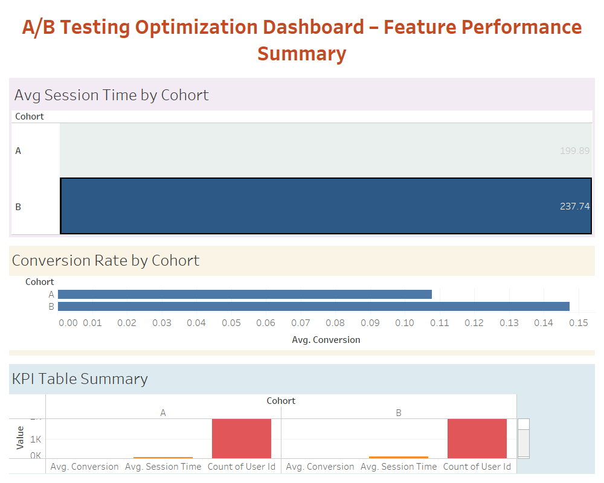

# 🧪 A/B Testing Optimization Dashboard – Feature Performance Analysis

This project showcases an end-to-end A/B test analysis workflow using **MySQL**, **Python**, and **Tableau**, designed to assess the impact of a feature rollout on user engagement and conversion.

---

## 📌 Project Objective

To measure and visualize the performance of a newly released feature by comparing two user cohorts (A & B) through a statistically sound A/B test. The dashboard enables product and UX teams to:

- Analyze average session time and conversion rates by cohort  
- Validate statistical differences between groups  
- Identify data-driven recommendations for feature release  

---

## 🛠 Tech Stack

- **SQL (MySQL)** – Data modeling, cohort aggregation, and view creation  
- **Python** *(optional)* – For CSV data generation and preprocessing  
- **Tableau** – Interactive dashboard for visualizing feature performance  

---

## 📊 Dashboard Overview

The dashboard includes:

- **Average Session Time by Cohort** – Bar chart comparing user engagement  
- **Conversion Rate by Cohort** – Bar chart showing uplift in conversion  
- **KPI Summary Table** – Cohort-level metrics including user count, average session time, conversion %, and test duration  

---

## 📂 Project Structure

├── ab_test_analysis_mysql.sql # SQL script to create tables and views
├── ab_testing_dashboard.twb # Tableau workbook file
├── README.md # Project documentation
└── screenshots/ └── dashboard_preview.png # Dashboard preview image

